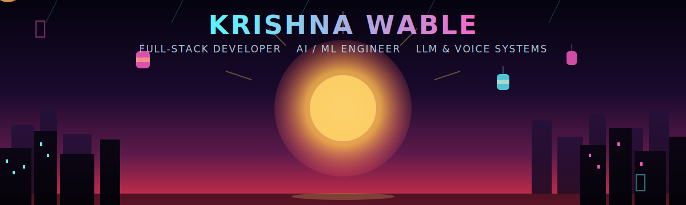

<div align="center">




<p align="center">
  <a href="https://linkedin.com/in/krishna-wable"></a>
  <a href="https://github.com/krish070904"></a>
  <a href="https://buildwithkrishna.vercel.app"></a>
  <a href="mailto:krishna.wable.mail@gmail.com"></a>
</p>


</div>

---


## 👨‍💻 About Me

```javascript
const krishnaWable = {
    role: "Full-Stack Developer & AI/ML Engineer",
    location: "Nashik, Maharashtra, India 🇮🇳",
    education: "B.Tech CSE, K.K. Wagh IEER | CGPA: 8.18 | 2026",

    currentlyBuilding: {
        company: "Bosch Limited — Industry 4.0 Digitalization Team",
        role: "Full Stack Developer Intern",
        shipping: "Digital Shopfloor Records System & Paperless Document System",
        impact: "~INR 0.2 Mn/month cost savings per department"
    },

    stack: {
        languages: ["Python", "JavaScript (ES6+)", "TypeScript", "C++"],
        frontend: ["React.js", "Next.js", "Redux", "Tailwind CSS"],
        backend: ["Node.js", "Express.js", "Django", "FastAPI"],
        databases: ["MongoDB", "PostgreSQL", "MySQL", "MS SQL Server"],
        ai_ml: ["LLM Fine-tuning (LoRA/PEFT)", "OpenAI / Gemini / BioMistral", "STT-TTS pipelines", "PyTorch", "TensorFlow"],
        cloud: ["Azure", "GCP", "Vercel", "Netlify", "Docker"]
    },

    currentFocus: "Open to Full-Stack, Backend, Frontend, and AI/ML roles 🎯",
    funFact: "Turns paper-based factory workflows into production software 🏭➡️💻"
};
```

<br clear="right"/>

---

## 🎯 What I Do

<table align="center">
<tr>
<td width="50%" valign="top">

### 🌐 Full-Stack Engineering
- ⚡ Production apps with React/Next.js + Django/Node.js
- 🔌 RESTful API design — 70+ APIs shipped across projects
- 🔐 RBAC, JWT auth, role-based enterprise systems
- ☁️ CI/CD pipelines, cloud deployment (Azure, Vercel)
- 📊 Real-time dashboards & data visualization

</td>
<td width="50%" valign="top">

### 🤖 AI/ML & LLM Engineering
- 🧠 LLM fine-tuning with LoRA & PEFT (Hugging Face)
- 💬 Multi-turn conversational memory systems
- 🗣️ STT/TTS voice pipeline integration
- 🩺 Domain-specific AI (BioMistral, ResNet-50, Gemini)
- 📈 Measurable gains — 15% accuracy improvement, 30% lower latency

</td>
</tr>
</table>

---

<div align="center">

## 💼 Professional Experience


</div>

### 🏢 Full Stack Developer Intern — Bosch Limited, Nashik
**📅 Jan 2026 – Jun 2026** | **Industry 4.0 Digitalization Team**

- 🏭 Built production full-stack apps (Next.js + Django) for shopfloor digitalization — live interactive dashboards, real-time monitoring, configurable alerts
- 🤖 Designed AI-powered form generation using OpenAI APIs with async pipelines, cutting manual paperwork significantly
- 🔐 Shipped RBAC interfaces, reusable React/TypeScript components, and API-driven workflows for an enterprise records platform
- 💰 Contributed to **~INR 0.2 Mn/month** cost savings per department
- 🛠️ Configured NEXEED MES & CM Control systems supporting the COMBAS digital transformation
- 🤝 Collaborated cross-functionally in Agile sprints; built a Genie-based use case at the internal NaP Hackathon 2026

**Tech:**    

### 🤖 AI/ML Intern — Samsara Wellness
**📅 Jun 2025 – Dec 2025** | **Remote**

- 🔬 Fine-tuned LLMs with LoRA & PEFT for a production mental-health chatbot — **15% accuracy improvement**
- 🧠 Engineered multi-turn context-retention system (last 50 conversations) in Node.js
- 💬 Built an empathetic, context-aware conversational AI integrated with STT/TTS pipelines
- ✅ Ran functional & end-to-end testing, tracked issues in Jira, validated AI outputs for reliability

**Tech:**    

---

<div align="center">

## 🚀 Featured Projects

</div>

<table>
<tr>
<td width="50%" valign="top">

### 🏭 Digital Shopfloor Records System
**Django · Next.js · OpenAI · REST APIs · RBAC**

Production-grade enterprise app replacing paper-based shopfloor workflows across multiple manufacturing departments — 28+ REST APIs, AI-powered form generation, RBAC across user levels.

📊 **~INR 0.2 Mn/month** saved per department · Adopted in production at Bosch

</td>
<td width="50%" valign="top">

### 🩺 HealthSync — Smart Healthcare Platform
**MERN · FastAPI · BioMistral 7B · ResNet-50 · Twilio**

Full-stack healthcare platform with 35+ REST APIs, JWT auth, automated health monitoring, AI symptom analysis, and SMS/email alerts.

🔗 [healthsync-care.vercel.app](https://healthsync-care.vercel.app) · [GitHub](https://github.com/krish070904/HEALTHSYNC_MERN)

</td>
</tr>
<tr>
<td width="50%" valign="top">

### 💳 CredLo — Smart Loan & Credit Assistant
**MERN · FastAPI · Python · Gemini**

LLM-powered loan recommendation engine using AHP and Fuzzy TOPSIS algorithms, ranking products across rate, tenure, and eligibility via 11+ REST APIs.

🔗 [credlo.framer.website](https://credlo.framer.website) · [GitHub](https://github.com/krish070904/CredLo)

</td>
<td width="50%" valign="top">

### 📊 CM Control Dashboard
**Next.js · REST APIs · Data Visualization**

High-performance monitoring dashboard integrating 5+ manufacturing REST APIs with interactive charts — deployed across 7 assembly & testing lines.

⚡ 35% smaller bundle via code splitting · LCP under 2.5s

</td>
</tr>
</table>

---

<div align="center">

## 💻 Tech Stack

</div>

**Languages**
<p align="center">
  
  
  
  
</p>

**Frontend**
<p align="center">
  
  
  
  
</p>

**Backend**
<p align="center">
  
  
  
  
</p>

**AI / Machine Learning**
<p align="center">
  
  
  
  
  
</p>

**Databases & Cloud**
<p align="center">
  
  
  
  
  
  
  
</p>

---

<div align="center">

## 🏆 Certifications

</div>

<table align="center">
<tr>
<td align="center" width="25%">

<br/>
**Cloud Foundations**

</td>
<td align="center" width="25%">

<br/>
**ML Specialization**

</td>
<td align="center" width="25%">

<br/>
**UI/UX Design**

</td>
<td align="center" width="25%">

<br/>
**Full-Stack Dev**

</td>
</tr>
</table>

---

<div align="center">

## 🐍 Contribution Graph


</div>

---

<div align="center">

### ✨ "Turning ideas into production systems — one shopfloor at a time" ✨


**⭐ From [Krishna Wable](https://github.com/krish070904) — Let's build something great**

</div>
